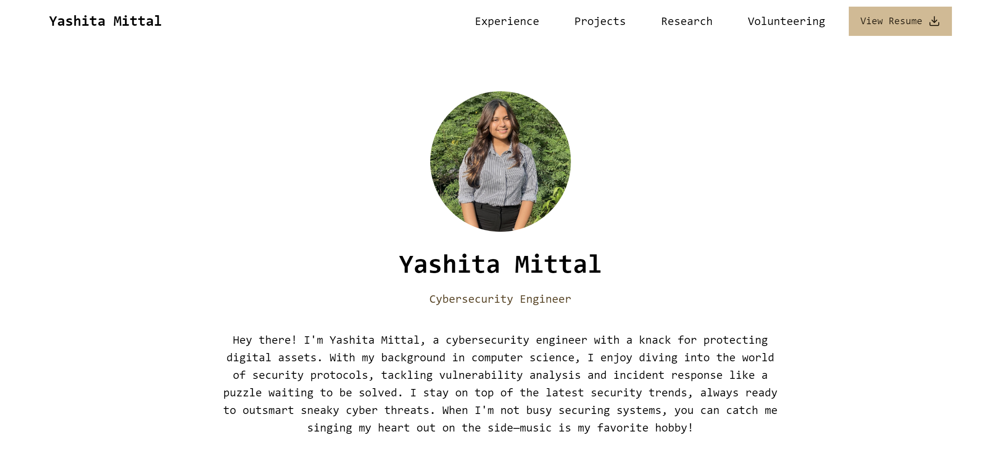

<h1 align="center">Portfolio Website</h1>

<p align="center">
	<a href="https://github.com/YashitaCodes/portfolio-website/blob/main/README.md"></a>
	<a href="#license"></a>
	<a href="https://github.com/YashitaCodes/portfolio-website/issues"></a>
	<a href="https://snyk.io/test/github/YashitaCodes/portfolio-website?targetFile=package.json"></a>
</p>


</img>

<p align="center" style="padding-top: 10px;">
	
	
	
	
	
	
	
	
</p>

## ✨ Overview

This repository contains my personal portfolio website, designed as a clean and minimal e-resume. The site showcases my skills, projects, and contact information, providing an easy way for potential employers and collaborators to connect with me.

## 🌟 Features

- **Clean and Minimal Design:** A simple, user-friendly interface that focuses on content.
- **Responsive Layout:** Fully responsive design that works seamlessly across devices.
- **Contact Form:** An easy-to-use contact form for inquiries and networking.

## ⚙️ Technologies Used

- **Next.js:** JavaScript framework for building server-rendered React applications.
- **Tailwind CSS:** A utility-first CSS framework for styling.
- **Framer Motion:** A library for creating animations in React applications.

## 🚀 Installation

1. Clone the repository:

   ```bash
   git clone https://github.com/YashitaCodes/portfolio-website.git
   ```

2. Navigate to the project directory:

   ```bash
   cd portfolio-website
   ```

3. Install dependencies:

   ```bash
   npm install
   ```

4. Start the development server:

   ```bash
   npm run dev
   ```

5. Open your browser and visit `http://localhost:3000` to view your portfolio.

## 🌐 Deployment

This website can be easily deployed using Vercel or Netlify. To deploy on Vercel:

1. Sign up or log in to [Vercel](https://vercel.com).
2. Import the project from your GitHub repository.
3. Follow the prompts to set up and deploy your site.

## 🤝 Contribution

Feel free to fork this repository and make improvements. Contributions are welcome!

## 📄 License

This project is licensed under the MIT License. See the [LICENSE](LICENSE.md) file for more information.

## 📬 Contact

For more information, please feel free to reach out via the contact form on the website or connect with me on [LinkedIn](https://linkedin.com/in/yashita-mittal).